# feat: Standalone Packaging with All Dependencies and CI/CD

## Overview

Transform the Zoom Chapter Splitter into a truly standalone macOS application that runs without any external dependencies. This includes fixing missing binary bundling (ffprobe), migrating from the deprecated keytar to Electron's safeStorage API, and implementing a complete CI/CD pipeline with code signing and notarization.

## Problem Statement / Motivation

**Current Issues:**

1. **ffprobe Not Bundled**: The app bundles `ffmpeg` but not `ffprobe`. The code falls back to system `ffprobe` which doesn't exist on most user machines, causing video info extraction to fail.

2. **Deprecated keytar Dependency**: `keytar` has been deprecated since December 2022. It requires native compilation (node-gyp) which complicates builds and can fail in CI environments. Modern Electron apps should use the built-in `safeStorage` API.

3. **No Automated Builds**: There's no CI/CD pipeline. Builds must be done manually, and there's no code signing or notarization—required for smooth macOS distribution (avoiding Gatekeeper warnings).

4. **Single Architecture**: Current build only produces arm64. Universal binary (arm64 + x64) would support all Macs.

## Proposed Solution

### Phase 1: Fix Binary Bundling (ffmpeg + ffprobe)

Replace `ffmpeg-static` with `ffmpeg-ffprobe-static` package which includes both binaries.

**Changes:**
- Update `package.json` dependencies
- Update `extraResources` in build config
- Update `src/main/utils/ffmpeg-path.ts` to use new package

### Phase 2: Migrate keytar to safeStorage

Replace the deprecated `keytar` native module with Electron's built-in `safeStorage` API.

**Changes:**
- Rewrite `src/main/services/keychain.service.ts`
- Add credential migration for existing users
- Update IPC handlers
- Remove `keytar` from dependencies and `asarUnpack`

### Phase 3: CI/CD with Code Signing

Implement GitHub Actions workflow for automated builds with proper macOS code signing and notarization.

**Changes:**
- Add `.github/workflows/build.yml`
- Configure electron-builder for notarization
- Add support for universal binary (arm64 + x64)
- Implement automated releases

## Technical Approach

### Architecture

```mermaid
graph TD
    subgraph "Phase 1: Binary Bundling"
        A[ffmpeg-ffprobe-static] --> B[extraResources Config]
        B --> C[ffmpeg-path.ts Update]
        C --> D[Both binaries in .app/Contents/Resources]
    end
    
    subgraph "Phase 2: safeStorage Migration"
        E[Old: keytar] --> F[Migration Layer]
        F --> G[New: safeStorage + encrypted JSON]
        G --> H[Remove keytar dependency]
    end
    
    subgraph "Phase 3: CI/CD"
        I[GitHub Actions] --> J[Build Matrix arm64/x64]
        J --> K[Code Signing]
        K --> L[Notarization]
        L --> M[GitHub Release]
    end
```



### Implementation Phases

#### Phase 1: Fix ffmpeg/ffprobe Bundling

**Estimated effort:** 1-2 hours

##### Tasks

- [ ] Replace `ffmpeg-static` with `ffmpeg-ffprobe-static` in package.json
- [ ] Update `extraResources` to bundle both ffmpeg and ffprobe
- [ ] Update `src/main/utils/ffmpeg-path.ts` for new package paths
- [ ] Test video info extraction in packaged app
- [ ] Verify both binaries exist in `.app/Contents/Resources/`

##### package.json Changes

```json
// Before
"dependencies": {
  "ffmpeg-static": "^5.2.0",
  // ...
}

// After
"dependencies": {
  "ffmpeg-ffprobe-static": "^6.1.2",
  // ...
}

// Update build.extraResources
"extraResources": [
  {
    "from": "node_modules/ffmpeg-ffprobe-static/ffmpeg",
    "to": "ffmpeg"
  },
  {
    "from": "node_modules/ffmpeg-ffprobe-static/ffprobe",
    "to": "ffprobe"
  }
]

// Update build.asarUnpack
"asarUnpack": [
  "**/node_modules/ffmpeg-ffprobe-static/**",
  "**/node_modules/keytar/**"  // Remove after Phase 2
]
```

##### src/main/utils/ffmpeg-path.ts

```typescript
import { app } from 'electron'
import { join } from 'path'
import { existsSync } from 'fs'

export function getFfmpegPath(): string {
  if (app.isPackaged) {
    const resourcePath = join(process.resourcesPath, 'ffmpeg')
    if (existsSync(resourcePath)) {
      return resourcePath
    }
  }
  
  // Development: use ffmpeg-ffprobe-static
  const ffmpegPath = require('ffmpeg-ffprobe-static').ffmpegPath
  return ffmpegPath
}

export function getFfprobePath(): string {
  if (app.isPackaged) {
    const resourcePath = join(process.resourcesPath, 'ffprobe')
    if (existsSync(resourcePath)) {
      return resourcePath
    }
  }
  
  // Development: use ffmpeg-ffprobe-static
  const ffprobePath = require('ffmpeg-ffprobe-static').ffprobePath
  return ffprobePath
}
```

---

#### Phase 2: Migrate keytar to safeStorage

**Estimated effort:** 2-3 hours

##### Tasks

- [ ] Research Electron safeStorage API usage patterns
- [ ] Create new `storage.service.ts` using safeStorage
- [ ] Implement credential migration from keytar (for existing users)
- [ ] Update `keychain.service.ts` to use new storage service
- [ ] Update IPC handlers
- [ ] Remove `keytar` from dependencies
- [ ] Remove `keytar` from `asarUnpack`
- [ ] Test on fresh install and upgrade scenarios

##### How safeStorage Works

Electron's `safeStorage` API encrypts strings using the OS keychain (macOS Keychain, Windows DPAPI, Linux Secret Service). Unlike keytar, it:
- Doesn't require native compilation
- Ships with Electron (no extra dependency)
- Used by VS Code, Element Desktop, and other major apps

##### src/main/services/storage.service.ts (New)

```typescript
import { safeStorage } from 'electron'
import { readFileSync, writeFileSync, existsSync } from 'fs'
import { join } from 'path'
import { app } from 'electron'

interface EncryptedStore {
  [key: string]: string // base64 encoded encrypted values
}

export class StorageService {
  private storePath: string
  private store: EncryptedStore = {}

  constructor() {
    this.storePath = join(app.getPath('userData'), 'secure-storage.json')
    this.load()
  }

  private load(): void {
    if (existsSync(this.storePath)) {
      try {
        const data = readFileSync(this.storePath, 'utf-8')
        this.store = JSON.parse(data)
      } catch {
        this.store = {}
      }
    }
  }

  private save(): void {
    writeFileSync(this.storePath, JSON.stringify(this.store, null, 2))
  }

  async get(key: string): Promise<string | null> {
    if (!safeStorage.isEncryptionAvailable()) {
      console.warn('Encryption not available')
      return null
    }

    const encrypted = this.store[key]
    if (!encrypted) return null

    try {
      const buffer = Buffer.from(encrypted, 'base64')
      return safeStorage.decryptString(buffer)
    } catch {
      return null
    }
  }

  async set(key: string, value: string): Promise<boolean> {
    if (!safeStorage.isEncryptionAvailable()) {
      console.warn('Encryption not available')
      return false
    }

    try {
      const encrypted = safeStorage.encryptString(value)
      this.store[key] = encrypted.toString('base64')
      this.save()
      return true
    } catch {
      return false
    }
  }

  async delete(key: string): Promise<boolean> {
    if (this.store[key]) {
      delete this.store[key]
      this.save()
      return true
    }
    return false
  }

  async has(key: string): Promise<boolean> {
    return key in this.store
  }
}
```

##### Migration Strategy

For users upgrading from keytar-based storage:

```typescript
// src/main/services/migration.service.ts
import keytar from 'keytar'
import { StorageService } from './storage.service'

const SERVICE_NAME = 'ZoomChapterSplitter'
const MIGRATION_KEY = '_migrated_from_keytar'

export async function migrateFromKeytar(storage: StorageService): Promise<void> {
  // Check if already migrated
  if (await storage.has(MIGRATION_KEY)) {
    return
  }

  try {
    // Get all credentials from keytar
    const credentials = await keytar.findCredentials(SERVICE_NAME)
    
    // Migrate each credential to safeStorage
    for (const { account, password } of credentials) {
      await storage.set(account, password)
      // Remove from keytar after successful migration
      await keytar.deletePassword(SERVICE_NAME, account)
    }

    // Mark as migrated
    await storage.set(MIGRATION_KEY, 'true')
    console.log('Successfully migrated credentials from keytar to safeStorage')
  } catch (error) {
    // keytar might not exist or be accessible - that's OK for new installs
    console.log('No keytar credentials to migrate (likely fresh install)')
    await storage.set(MIGRATION_KEY, 'true')
  }
}
```

##### Updated keychain.service.ts

```typescript
import { StorageService } from './storage.service'

export class KeychainService {
  private storage: StorageService

  constructor() {
    this.storage = new StorageService()
  }

  async getKey(account: string): Promise<string | null> {
    return this.storage.get(account)
  }

  async setKey(account: string, password: string): Promise<boolean> {
    return this.storage.set(account, password)
  }

  async deleteKey(account: string): Promise<boolean> {
    return this.storage.delete(account)
  }

  async hasKey(account: string): Promise<boolean> {
    return this.storage.has(account)
  }
}
```

---

#### Phase 3: CI/CD with Code Signing & Notarization

**Estimated effort:** 4-6 hours (includes Apple Developer setup)

##### Prerequisites

1. **Apple Developer Account** ($99/year)
2. **Developer ID Application Certificate**
3. **App-specific password** for notarization
4. **GitHub repository secrets** configured

##### Tasks

- [ ] Create Apple Developer ID Application certificate
- [ ] Generate app-specific password for notarization
- [ ] Export certificate as base64 for GitHub Actions
- [ ] Add GitHub repository secrets
- [ ] Create `.github/workflows/build.yml`
- [ ] Update `package.json` build config for notarization
- [ ] Test workflow with manual trigger
- [ ] Configure automatic releases on tag push

##### GitHub Repository Secrets Required

| Secret | Description |
|--------|-------------|
| `APPLE_CERTIFICATE_BASE64` | Base64-encoded .p12 certificate |
| `APPLE_CERTIFICATE_PASSWORD` | Password for the .p12 file |
| `APPLE_ID` | Apple Developer account email |
| `APPLE_ID_PASSWORD` | App-specific password (not account password) |
| `APPLE_TEAM_ID` | Team ID from Apple Developer portal |

##### .github/workflows/build.yml

```yaml
name: Build and Release

on:
  push:
    tags:
      - 'v*'
  workflow_dispatch:
    inputs:
      version:
        description: 'Version to build (without v prefix)'
        required: false

env:
  NODE_VERSION: '20'

jobs:
  build-macos:
    runs-on: macos-latest
    strategy:
      matrix:
        arch: [x64, arm64]
    
    steps:
      - name: Checkout
        uses: actions/checkout@v4

      - name: Setup Node.js
        uses: actions/setup-node@v4
        with:
          node-version: ${{ env.NODE_VERSION }}
          cache: 'npm'

      - name: Install dependencies
        run: npm ci

      - name: Install Apple certificate
        env:
          APPLE_CERTIFICATE_BASE64: ${{ secrets.APPLE_CERTIFICATE_BASE64 }}
          APPLE_CERTIFICATE_PASSWORD: ${{ secrets.APPLE_CERTIFICATE_PASSWORD }}
        run: |
          # Create keychain
          KEYCHAIN_PATH=$RUNNER_TEMP/build.keychain
          KEYCHAIN_PASSWORD=$(openssl rand -base64 32)
          
          security create-keychain -p "$KEYCHAIN_PASSWORD" "$KEYCHAIN_PATH"
          security set-keychain-settings -lut 21600 "$KEYCHAIN_PATH"
          security unlock-keychain -p "$KEYCHAIN_PASSWORD" "$KEYCHAIN_PATH"
          
          # Import certificate
          echo "$APPLE_CERTIFICATE_BASE64" | base64 --decode > certificate.p12
          security import certificate.p12 -P "$APPLE_CERTIFICATE_PASSWORD" \
            -k "$KEYCHAIN_PATH" -T /usr/bin/codesign -T /usr/bin/security
          
          security set-key-partition-list -S apple-tool:,apple: -s \
            -k "$KEYCHAIN_PASSWORD" "$KEYCHAIN_PATH"
          
          security list-keychains -d user -s "$KEYCHAIN_PATH" login.keychain
          
          rm certificate.p12

      - name: Build and Package
        env:
          APPLE_ID: ${{ secrets.APPLE_ID }}
          APPLE_ID_PASSWORD: ${{ secrets.APPLE_ID_PASSWORD }}
          APPLE_TEAM_ID: ${{ secrets.APPLE_TEAM_ID }}
          CSC_LINK: ${{ secrets.APPLE_CERTIFICATE_BASE64 }}
          CSC_KEY_PASSWORD: ${{ secrets.APPLE_CERTIFICATE_PASSWORD }}
        run: |
          npm run build
          npm run package -- --arch=${{ matrix.arch }}

      - name: Upload artifacts
        uses: actions/upload-artifact@v4
        with:
          name: macos-${{ matrix.arch }}
          path: |
            dist/*.dmg
            dist/*.zip
          retention-days: 7

  release:
    needs: build-macos
    runs-on: ubuntu-latest
    if: startsWith(github.ref, 'refs/tags/')
    
    steps:
      - name: Download all artifacts
        uses: actions/download-artifact@v4
        with:
          path: artifacts

      - name: Create Release
        uses: softprops/action-gh-release@v1
        with:
          files: artifacts/**/*
          draft: true
          generate_release_notes: true
        env:
          GITHUB_TOKEN: ${{ secrets.GITHUB_TOKEN }}
```

##### Updated package.json Build Config

```json
{
  "build": {
    "appId": "com.zoomchaptersplitter.app",
    "productName": "Zoom Chapter Splitter",
    "mac": {
      "category": "public.app-category.video",
      "target": [
        {
          "target": "dmg",
          "arch": ["x64", "arm64"]
        },
        {
          "target": "zip",
          "arch": ["x64", "arm64"]
        }
      ],
      "hardenedRuntime": true,
      "gatekeeperAssess": false,
      "entitlements": "build/entitlements.mac.plist",
      "entitlementsInherit": "build/entitlements.mac.plist",
      "notarize": {
        "teamId": "${env.APPLE_TEAM_ID}"
      }
    },
    "files": [
      "out/**/*",
      "!node_modules/**/*"
    ],
    "extraResources": [
      {
        "from": "node_modules/ffmpeg-ffprobe-static/ffmpeg",
        "to": "ffmpeg"
      },
      {
        "from": "node_modules/ffmpeg-ffprobe-static/ffprobe",
        "to": "ffprobe"
      }
    ],
    "asarUnpack": [
      "**/node_modules/ffmpeg-ffprobe-static/**"
    ]
  }
}
```

---

## Acceptance Criteria

### Functional Requirements

- [ ] App launches without any system dependencies required
- [ ] Video info extraction works (ffprobe bundled correctly)
- [ ] Video export works (ffmpeg bundled correctly)
- [ ] API key storage works (safeStorage implementation)
- [ ] Existing users' API keys are migrated automatically
- [ ] App passes macOS Gatekeeper (code signed + notarized)
- [ ] Both arm64 and x64 builds available

### Non-Functional Requirements

- [ ] Build completes in < 15 minutes on GitHub Actions
- [ ] DMG size is reasonable (< 200MB)
- [ ] No security warnings when opening app
- [ ] Migration from keytar is seamless (no user action required)

### Quality Gates

- [ ] All builds produce working DMGs
- [ ] Notarization succeeds (verify with `spctl --assess`)
- [ ] Test on fresh macOS install (no dev tools)
- [ ] Test upgrade from previous version (keytar migration)

## Success Metrics

| Metric | Target |
|--------|--------|
| App opens without errors on fresh macOS | 100% |
| Video processing works end-to-end | 100% |
| Build success rate in CI | > 95% |
| Time from tag push to release | < 20 min |

## Dependencies & Prerequisites

### Required Before Starting

| Dependency | Status | Notes |
|------------|--------|-------|
| Apple Developer Account | TBD | Required for code signing ($99/year) |
| GitHub repository | ✅ | Already exists |
| Node.js 18+ | ✅ | Current requirement |

### Technical Dependencies

| Package | Current | Target | Notes |
|---------|---------|--------|-------|
| `ffmpeg-static` | 5.2.0 | Remove | Replace with ffmpeg-ffprobe-static |
| `ffmpeg-ffprobe-static` | N/A | 6.1.2 | Add new |
| `keytar` | 7.9.0 | Remove | Replace with safeStorage |
| `electron` | 33.2.1 | Keep | Already supports safeStorage |

## Risk Analysis & Mitigation

| Risk | Probability | Impact | Mitigation |
|------|-------------|--------|------------|
| Apple certificate issues | Medium | High | Document certificate creation steps; test locally first |
| keytar migration data loss | Low | High | Keep keytar as optional fallback for 1 release cycle |
| ffmpeg-ffprobe-static size increase | Low | Low | Package is similar size; acceptable tradeoff |
| CI build failures | Medium | Medium | Test workflow manually before relying on it |
| Notarization timeout | Low | Medium | electron-builder handles retries; increase timeout if needed |

## Future Considerations

1. **Auto-updates**: Implement electron-updater for automatic updates
2. **Windows/Linux**: Extend CI/CD for cross-platform builds
3. **Universal binary**: Consider single universal binary vs separate arm64/x64
4. **Crash reporting**: Add Sentry or similar for production error tracking

## References & Research

### Internal References

- `package.json:38-63` — Current build configuration
- `src/main/utils/ffmpeg-path.ts` — Binary path resolution
- `src/main/services/keychain.service.ts` — Current keytar usage
- `build/entitlements.mac.plist` — macOS security entitlements

### External References

- [ffmpeg-ffprobe-static npm package](https://www.npmjs.com/package/ffmpeg-ffprobe-static)
- [Electron safeStorage API](https://www.electronjs.org/docs/latest/api/safe-storage)
- [VS Code migration from keytar](https://code.visualstudio.com/updates/v1_80#_secretstorage-api-now-uses-electron-api-over-keytar)
- [electron-builder notarization docs](https://www.electron.build/configuration/mac#notarization)
- [GitHub Actions for Electron](https://github.com/omkarcloud/macos-code-signing-example)
- [keytar deprecation notice](https://github.com/atom/node-keytar/issues/482)
